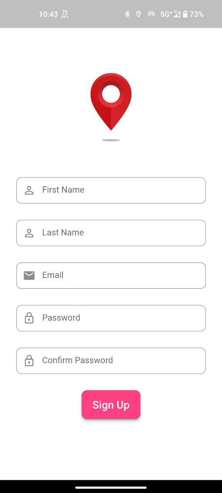
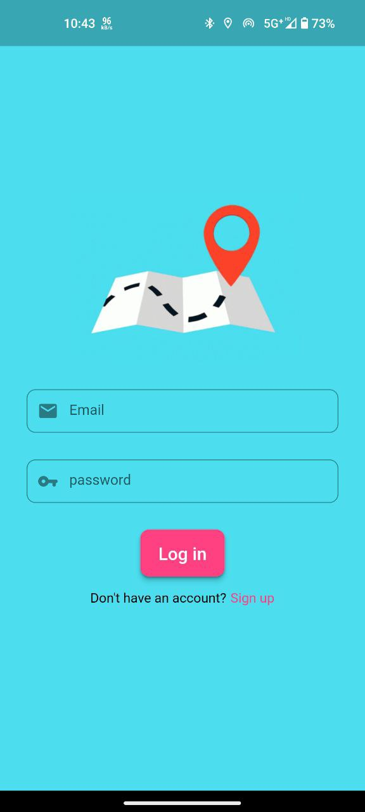

# hostel_management_app

  <h1 align="center">Hostel Management App</h1>

## Technologies...

- 🚀️ Flutter for the UI.
- 🏅️ Material Icon.
- 💪️ Firebase Authentication
- 📅️ User Login & SignUp Page
- 💎️ Comment section below each hostel page
- ⏲️ Beautiful Navigation UI
- 🌙️ Better integration with the dark theme.
- 🎉️ and much more.

<h3 align="left">Languages and Tools Used:</h3>

  </a>       

